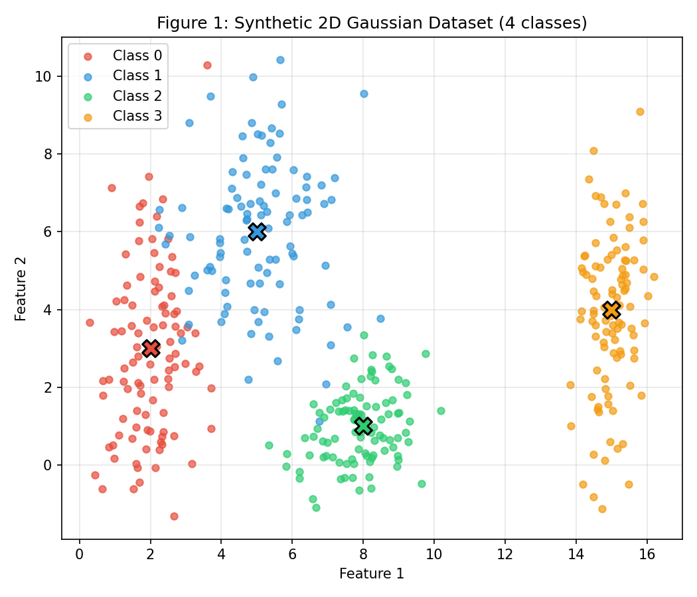
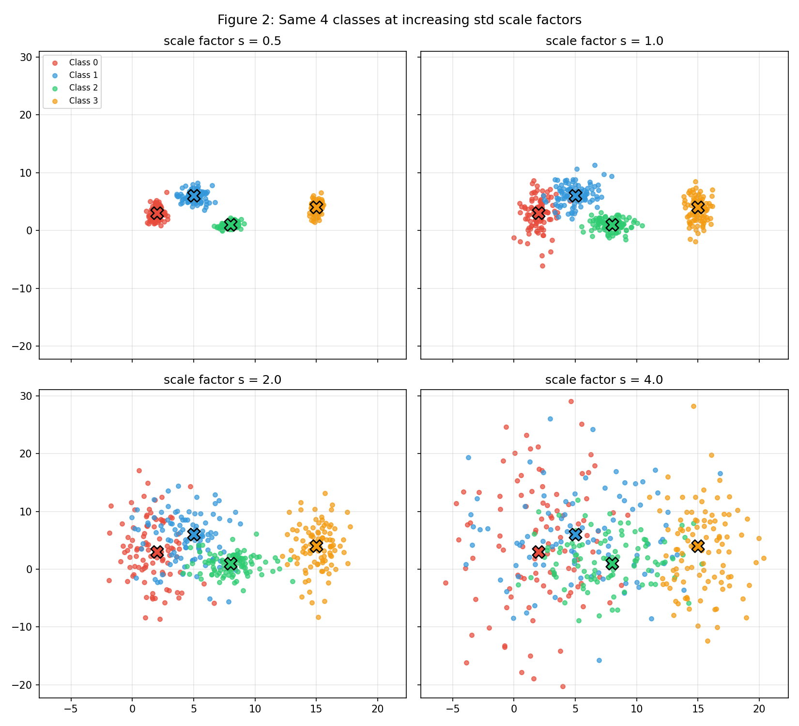
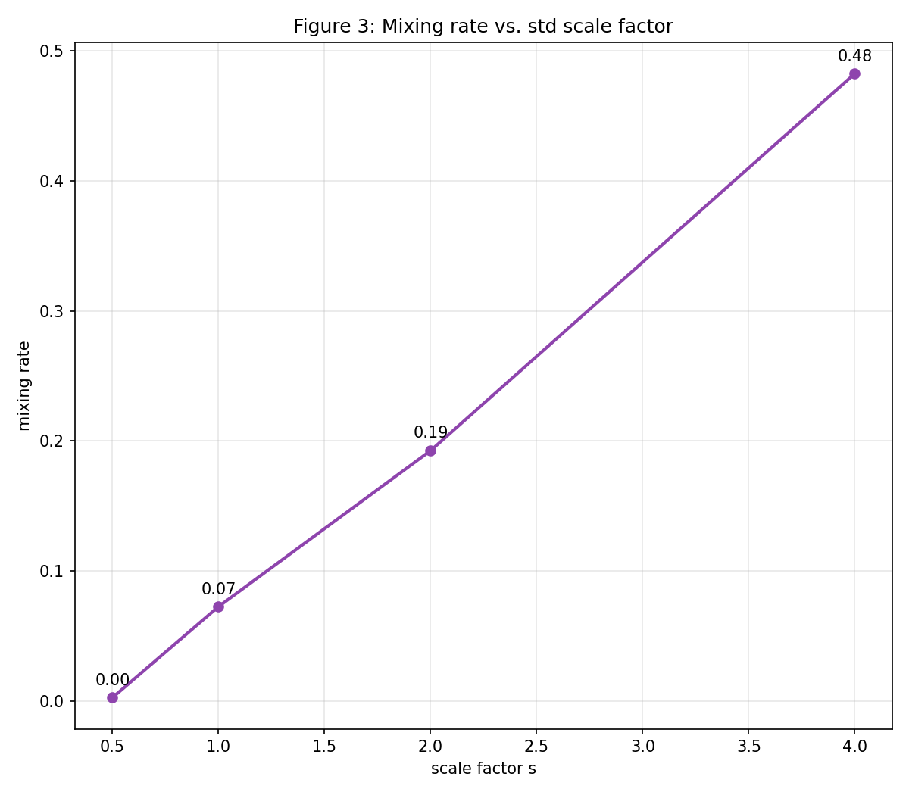
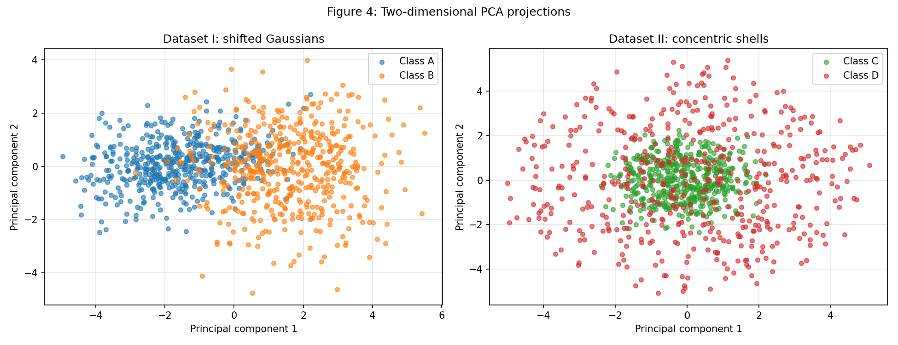
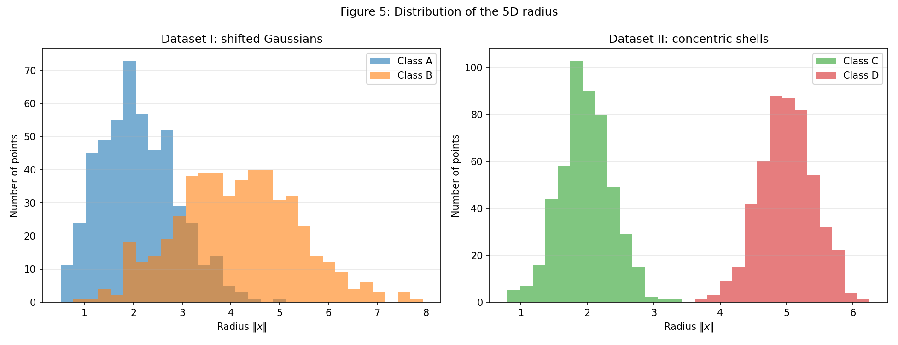
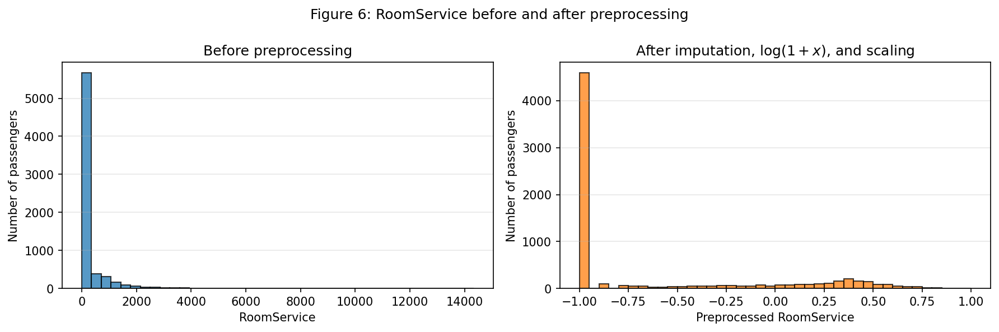

# 1. Data

!!! abstract "Assignment"

    [Exercises → Data](https://insper.github.io/ann-dl/2026.2/exercises/data/){:target='_blank'}

## Data Preparation and Analysis for Neural Networks

This activity explores how data spreads across space — its shape, direction, and density — and how that spread shapes the challenge of separating one class from another. Below, you'll find a series of synthetic datasets that illustrate this idea: as point clouds stretch, rotate, or overlap in different ways, the difficulty of classifying them shifts accordingly. Alongside generating and visualizing this data, the examples also touch on the practical side of getting it ready for a neural network, from cleaning up irregularities to formatting it for training.

## Exercise 1 - Point Clouds: Geometry and Spread in 2D

Before jumping into network architecture, it's worth understanding how the data itself is distributed. Here, I generate and measure two-dimensional point clouds, looking at how their spread and shape influence the complexity of the decision boundaries a network would need to learn to tell them apart.

### A - Generating the Clouds

Here, a synthetic dataset of 400 points is built across 4 classes, 100 points each. Every class is generated from a Gaussian distribution, with each one defined by its own set of parameters—controlling where it's centered and how it spreads.

The parameters used to generate each cloud were:

* **Class 0**: Mean = [2, 3], Standard Deviation = [0.8, 2.5]
* **Class 1**: Mean = [5, 6], Standard Deviation = [1.2, 1.9]
* **Class 2**: Mean = [8, 1], Standard Deviation = [0.9, 0.9]
* **Class 3**: Mean = [15, 4], Standard Deviation = [0.5, 2.0]

Below, you can check the code that generated these clouds.

``` { .python .copy .select linenums="1" }
   --8<-- "exercises/data/exercise1.py:itemA"
```

Figure 1 below shows a 2D scatter plot of all the points, colored by class, with each cloud's center marked on the plot.



### B - More or Less Spread Out

The standard deviation controls how much each cloud spreads around its center. Here, the same 4 classes from before are regenerated four times over, multiplying all standard deviations by a scale factor $s$—the means stay fixed, only the spread changes:

$$s \in \{0.5,\ 1.0,\ 2.0,\ 4.0\}$$

This produces 4 separate datasets of 4 classes each. Below, you can check the code that generated these 4 datasets.

``` { .python .copy .select linenums="1" }
   --8<-- "exercises/data/exercise1.py:itemB-dataset"
```

Figure 2 shows 4 subplots (one per value of $s$), sharing the same axis limits so the comparison is fair.



For $s = 1$ only, the separation ratio is computed for each pair of classes $(i, j)$ — a measure of how distinct two clouds are relative to their size, comparing the distance between their centers to their average spread. The higher the ratio, the more cleanly separated the classes are; values below 1 suggest the clouds are close enough to overlap:

$$r_{ij} = \frac{\|\mu_i - \mu_j\|}{\bar{\sigma}_i + \bar{\sigma}_j}, \qquad \bar{\sigma}_k = \frac{\sigma_{k,x} + \sigma_{k,y}}{2}$$

There are 6 pairs in total—these are reported in a table below, along with which pair has the smallest ratio.

| Pair | Distance | std_i + std_j | Ratio |
|------|----------|----------------|-------|
| (0,1) | 4.243  | 3.200 | 1.326 |
| (0,2) | 6.325  | 2.550 | 2.480 |
| (0,3) | 13.038 | 2.900 | 4.496 |
| (1,2) | 5.831  | 2.450 | 2.379 |
| (1,3) | 10.198 | 2.800 | 3.642 |
| (2,3) | 7.616  | 2.150 | 3.542 |

Smallest ratio: pair (0,1) = 1.326 at $s = 1$ <br>
At $s = 2$, that smallest ratio becomes: $1.326 / 2 = 0.663$

``` { .python .copy .select linenums="1" }
   --8<-- "exercises/data/exercise1.py:itemB-separation"
```

Since the means never change, $r_{ij}$ scales with $1/s$: this makes it possible to state what the smallest $r_{ij}$ becomes at $s = 2$ without having to generate anything new—just by scaling the existing value.

Beyond that single ratio, a broader measure is used to track separability across all four scale factors: the mixing rate, defined as the fraction of points whose *nearest* class center isn't their own. This is computed purely geometrically, by comparing each point against the 4 means.

| $s$ | Mixing rate |
|-----|-------------|
| 0.5 | 0.003 (0.3%) |
| 1.0 | 0.072 (7.2%) |
| 2.0 | 0.193 (19.3%) |
| 4.0 | 0.482 (48.2%) |

``` { .python .copy .select linenums="1" }
   --8<-- "exercises/data/exercise1.py:itemB-mixing"
```

Figure 3 plots this mixing rate against $s$, making it possible to answer: at which scale factor do the clouds stop being separable by straight lines? And what happens to the smallest $r_{ij}$ at that same point?

``` { .python .copy .select linenums="1" }
   --8<-- "exercises/data/exercise1.py:itemB-plot"
```



At s ≈ 1.33, the closest pair of classes (0 and 1) stop being linearly separable — that's where their separation ratio $r_{01}$ crosses below 1.

At that same point, the smallest $r_{ij}$ (for pair 0,1) drops to exactly 1 (from 1.326 at s=1) and keeps falling below 1 as s increases further — meaning the distance between class means is no longer larger than their combined spread, so the clouds start overlapping instead of being cleanly separable by a line.

### C - Analysis

Answering the questions below:

1. Describe the overlap of the four classes in the original dataset (s=1). Could a single linear boundary separate all classes? What about a set of linear boundaries?

    **A:** In the original dataset (s=1), the four classes form distinguishable clusters, although some overlap occurs, especially between the closer classes 0 and 1. A single linear boundary cannot separate four classes because it divides the plane into only two regions. A set of linear boundaries could create one decision region for each class and achieve good separation, but perfect classification would still be unlikely in the overlapping areas.

2. Sketch on Figure 1 the decision boundaries you think a trained neural network might learn.

    **A:** A trained neural network would likely learn several piecewise-linear decision boundaries that divide the plane into four regions, one for each class. These boundaries would generally lie between neighboring clusters and adjust to their different positions and spreads. The boundary between classes 0 and 1 would be the most difficult to place because these classes have the greatest relative overlap.

3. Relate your sketch to item B: the more spread out the clouds are, what happens to the region where the network necessarily makes mistakes?

    **A:** As the clouds become more spread out, the overlap between classes increases. Consequently, the regions where points from different classes are mixed become larger. In these regions, even an optimal neural network cannot classify every point correctly because similar points may belong to different classes. Therefore, increasing the standard deviation enlarges the unavoidable error regions and increases the expected misclassification rate.

## Exercise 2 - Non-Linearity in Higher Dimensions

A simple network like a Perceptron can only draw straight-line boundaries between classes. Deep networks earn their advantage precisely when the data can't be split that way. This part compares two datasets of the same dimensionality, side by side, to make that contrast concrete.

### A - Dataset I: Shifted Gaussians

For this dataset, 500 samples are generated for Class A and another 500 for Class B, each drawn from a multivariate normal distribution using the parameters below:

* **Class A**:

  Mean vector:

  $\mu_A = [0, 0, 0, 0, 0]$

  Covariance matrix:

  $\Sigma_A = \begin{pmatrix} 1.0 & 0.8 & 0.1 & 0.0 & 0.0 \\ 0.8 & 1.0 & 0.3 & 0.0 & 0.0 \\ 0.1 & 0.3 & 1.0 & 0.5 & 0.0 \\ 0.0 & 0.0 & 0.5 & 1.0 & 0.2 \\ 0.0 & 0.0 & 0.0 & 0.2 & 1.0 \end{pmatrix}$

* **Class B**:

  Mean vector:

  $\mu_B = [1.5, 1.5, 1.5, 1.5, 1.5]$

  Covariance matrix:

  $\Sigma_B = \begin{pmatrix} 1.5 & -0.7 & 0.2 & 0.0 & 0.0 \\ -0.7 & 1.5 & 0.4 & 0.0 & 0.0 \\ 0.2 & 0.4 & 1.5 & 0.6 & 0.0 \\ 0.0 & 0.0 & 0.6 & 1.5 & 0.3 \\ 0.0 & 0.0 & 0.0 & 0.3 & 1.5 \end{pmatrix}$

``` { .python .copy .select linenums="1" }
   --8<-- "exercises/data/exercise2.py:itemA"
```

### B - Dataset II: Concentric Shells

Here, a second dataset is built—again 500 samples per class, still in 5 dimensions—but this time the two classes aren't placed at different centers. Instead, they're built around the same origin, distinguished only by *how far* their points sit from it:

1. First, a random direction is picked in 5D space: a vector $v \sim \mathcal{N}(0, I_5)$ is sampled and normalized to unit length, $u = v / \|v\|$, so every direction is equally likely;
2. **Class C (the core)**: points sit close to the origin, at a distance $\rho \sim \mathcal{N}(2.0, 0.4)$;
3. **Class D (the shell)**: points sit farther out, at a distance $\rho \sim \mathcal{N}(5.0, 0.4)$;
4. Each point is then placed at $x = \rho \cdot u$—stretching the direction $u$ out to its assigned distance $\rho$.

The result is one class forming a dense ball near the center, and the other forming a shell surrounding it.

``` { .python .copy .select linenums="1" }
   --8<-- "exercises/data/exercise2.py:itemB"
```

### C - Visualize and Compare

Since a 5D space can't be visualized directly, dimensionality reduction is needed to see what's going on.

PCA (Principal Component Analysis) is used for this: a technique that finds the directions along which the data varies the most, and projects the points onto just the top few of those directions—in this case, the top 2. This gives the best possible 2D "flattening" of the 5D data, in the sense that it preserves as much of the original spread as it can.

Here, PCA is applied to project each dataset into 2 dimensions, producing two scatter plots side by side, colored by class.

``` { .python .copy .select linenums="1" }
   --8<-- "exercises/data/exercise2.py:itemC-pca"
```

The result can be seen in Figure 4.



The explained variance of the first two components is reported for each dataset, indicating how much of the original 5D spread survives the drop to 2D—and, from that, in which dataset the 2D projection better preserves the information relevant for classification.

| Dataset               |    PC1 |    PC2 |  Total |
| --------------------- | -----: | -----: | ---------: |
| Shifted Gaussians | 50.04% | 15.93% | 65.97% |
| Concentric Shells | 21.59% | 21.32% | 42.91% |

Conclusion: Dataset I better preserves the information relevant for classification in the 2D projection.

``` { .python .copy .select linenums="1" }
   --8<-- "exercises/data/exercise2.py:itemC-explained_variance"
```

For each dataset, the distance between the class centers, $\|\mu_1 - \mu_2\|$, is computed directly in the original 5D space, without relying on any projection.

| Dataset               | Class Centers                                                                         | Distance |
| --------------------- | ------------------------------------------------------------------------------------- | -----------: |
| Shifted Gaussians | A: [0.026, 0.085, 0.037, 0.019, 0.035]<br>B: [1.489, 1.499, 1.450, 1.458, 1.524]      |    3.228 |
| Concentric Shells | C: [0.062, 0.017, −0.034, −0.001, 0.043]<br>D: [−0.108, −0.107, −0.142, 0.014, 0.166] |    0.266 |

``` { .python .copy .select linenums="1" }
   --8<-- "exercises/data/exercise2.py:itemC-distance"
```

Figure 5 then shows, for each dataset, a histogram of each point's radius $\|x\|$—how far it sits from the origin—with both classes overlaid on the same axis.

``` { .python .copy .select linenums="1" }
   --8<-- "exercises/data/exercise2.py:itemC-radii"
```


### D - Analysis

Answering the questions below:

1. In Dataset II the distance between the centers is close to zero, yet the radius histograms are well separated. What does that combination tell you about the possibility of separating the classes with a hyperplane?

    **A:** This combination shows that the difference between the classes is not their location but their distance from the origin. Class C forms an inner region, while Class D forms an outer shell surrounding it. A hyperplane separates points according to their position along a particular direction, so it cannot isolate the inner class from a class that surrounds it in every direction. Therefore, the classes are not linearly separable, despite their well-separated radii.

2. Explain why the structure of Dataset II cannot be solved by a linear boundary, no matter how much data is collected.

    **A:** Dataset II has a concentric structure: Class C is concentrated around radius 2, and Class D is concentrated around radius 5. A linear boundary divides the space into two half-spaces, but separating these classes requires a closed boundary around the inner class. Collecting more data makes the concentric structure clearer, but it does not change its geometry. Therefore, no single linear boundary can correctly separate the classes. A nonlinear boundary, such as a hypersphere, is required.

3. PCA is a linear transformation. Discuss: does a 2D projection in which the classes look mixed prove that they are inseparable in the original space?

    **A:** No. PCA projects the data onto a lower-dimensional linear subspace, so information contained in the discarded dimensions can be lost. In Dataset II, the first two principal components preserve only about 43% of the total variance. Furthermore, because the shell structure extends across all five dimensions, points with a large 5D radius may appear close to the origin after projection if much of their magnitude lies in the three discarded dimensions. Thus, the classes may look mixed in the PCA plot even though their 5D radii are well separated.


    The radius histograms show that Dataset II can be separated using the nonlinear function

    $$
    f(x) = \lVert x \rVert_2
        = \sqrt{x_1^2 + x_2^2 + x_3^2 + x_4^2 + x_5^2}.
    $$

    Since the classes have mean radii 2 and 5, a reasonable threshold is their midpoint:

    $$
    \hat{y}(x) =
    \begin{cases}
    C, & \text{if } \lVert x \rVert_2 < 3.5, \\
    D, & \text{if } \lVert x \rVert_2 \geq 3.5.
    \end{cases}
    $$

## Exercise 3 - Preparing Real-World Data for a Neural Network

This part shifts to a real-world dataset from Kaggle. The focus here is on preprocessing it appropriately—getting it into the shape a neural network expects, specifically one using the hyperbolic tangent (`tanh`) activation function in its hidden layers.

### A - Get to Know the Data 

The dataset used here is the [Spaceship Titanic](https://www.kaggle.com/competitions/spaceship-titanic) dataset from Kaggle, using `train.csv`—the only file with labels.

``` { .python .copy .select linenums="1" }
   --8<-- "exercises/data/exercise3.py:itemA-download"
```

The goal of the Spaceship Titanic dataset is to predict whether each passenger was transported to an alternate dimension after the spaceship collided with a spacetime anomaly. This outcome is represented by the binary target column `Transported`:

* `True`: the passenger was transported.
* `False`: the passenger was not transported.

The training dataset contains 8,693 passengers, distributed as follows:

| Transported | Count | Percentage |
| ----------- | ----: | ---------: |
| `True`      | 4,378 |     50.36% |
| `False`     | 4,315 |     49.64% |

The two classes are nearly evenly distributed, with a difference of only 63 passengers. Therefore, the dataset is well balanced, and no specific technique for handling class imbalance is necessary.

``` { .python .copy .select linenums="1" }
   --8<-- "exercises/data/exercise3.py:itemA-class-balance"
```

Next, the input features are grouped into numerical, categorical, and identifier/text columns.

Numerical features

* `Age`: the passenger’s age.
* `RoomService`: the amount spent on room service.
* `FoodCourt`: the amount spent at the food court.
* `ShoppingMall`: the amount spent at the shopping mall.
* `Spa`: the amount spent at the spa.
* `VRDeck`: the amount spent on the virtual-reality deck.

Categorical features

* `HomePlanet`: the passenger’s planet of origin.
* `CryoSleep`: whether the passenger was placed in suspended animation.
* `Cabin`: the passenger’s cabin, represented in the format `deck/number/side`.
* `Destination`: the passenger’s destination planet.
* `VIP`: whether the passenger paid for VIP service.

Identifier and text columns

* `PassengerId`: a unique passenger identifier in the format `group_number/passenger_number`.
* `Name`: the passenger’s full name.

Although `PassengerId` and `Name` are not regular categorical features because most of their values are unique, they may still contain useful information. For example, `PassengerId` can be used to identify passengers traveling in the same group, while `Name` may help identify family relationships.

Finally, `Transported` is the target variable that the model aims to predict, so it is not included among the input features.

A table then reports missing values per column, both as an absolute count and as a percentage.

| Column         | Missing values | Missing percentage |
| :------------- | -------------: | -----------------: |
| `CryoSleep`    |            217 |              2.50% |
| `ShoppingMall` |            208 |              2.39% |
| `VIP`          |            203 |              2.34% |
| `HomePlanet`   |            201 |              2.31% |
| `Name`         |            200 |              2.30% |
| `Cabin`        |            199 |              2.29% |
| `VRDeck`       |            188 |              2.16% |
| `Spa`          |            183 |              2.11% |
| `FoodCourt`    |            183 |              2.11% |
| `Destination`  |            182 |              2.09% |
| `RoomService`  |            181 |              2.08% |
| `Age`          |            179 |              2.06% |
| `PassengerId`  |              0 |              0.00% |
| `Transported`  |              0 |              0.00% |

``` { .python .copy .select linenums="1" }
   --8<-- "exercises/data/exercise3.py:itemA-missing-values"
```

Finally, for the spending columns (`RoomService`, `FoodCourt`, `ShoppingMall`, `Spa`, `VRDeck`), the mean, median, and maximum are reported. 

| Feature        |   Mean | Median |  Maximum |
| :------------- | -----: | -----: | -------: |
| `RoomService`  | 224.69 |    0.0 | 14,327.0 |
| `FoodCourt`    | 458.08 |    0.0 | 29,813.0 |
| `ShoppingMall` | 173.73 |    0.0 | 23,492.0 |
| `Spa`          | 311.14 |    0.0 | 22,408.0 |
| `VRDeck`       | 304.85 |    0.0 | 24,133.0 |

All five spending features have a median of zero, meaning that at least half of the passengers spent nothing in each category. In contrast, their means are noticeably greater than zero, and their maximum values are very high.

This difference between the mean and median suggests that the distributions are strongly right-skewed. In other words, most passengers spent little or nothing, while a small number spent very large amounts, pulling the mean upward.

The large gap between zero and the maximum values also suggests considerable variation and the presence of extreme values. Among the five features, `FoodCourt` has both the highest average and the highest maximum spending.

It is important to note that the difference between the mean and median mainly indicates skewness, not the amount of variation itself. Measures such as the standard deviation or interquartile range would be more appropriate for quantifying the spread.

``` { .python .copy .select linenums="1" }
   --8<-- "exercises/data/exercise3.py:itemA-spending-summary"
```

### B - Split Before Transform

The data is split into train and test sets, 80/20, stratified by the target, using a fixed seed for reproducibility.

The split must be performed before imputation and scaling so that these preprocessing steps are fitted using only the training data. Otherwise, information from the test set could influence the imputed values and scaling parameters, causing data leakage and producing an overly optimistic evaluation of the model.

``` { .python .copy .select linenums="1" }
   --8<-- "exercises/data/exercise3.py:itemB-split"
```

### C - Preprocess

Since `tanh` squashes everything into $[-1, 1]$, the inputs needed to be on a similar scale first.

**1. Missing data:** The imputation approach for each column depended on whether it was numerical or categorical.

Numerical features had their missing values replaced with the median from the training set. This was chosen over the mean since the spending variables are strongly right-skewed and contain extreme outliers, making the median a more robust measure of central tendency.

Categorical features, on the other hand, were imputed using the most frequent category per column. Since missing values made up only a small proportion of these columns, this approach preserves valid, realistic categories without distorting the distribution.

In both cases, the imputer was fit exclusively on the training set and then applied to the test set, avoiding any leakage of test information into training.

``` { .python .copy .select linenums="1" }
   --8<-- "exercises/data/exercise3.py:itemC-missing-data"
```

**2. Categorical features:** `HomePlanet`, `CryoSleep`, `Destination`, and `VIP` were converted to numerical format using one-hot encoding, since this method creates one binary column per category without imposing an artificial numerical order between them.

The encoder was fitted only on the training set and then applied to the test set. Setting `handle_unknown="ignore"` ensures that any category present in the test set but absent from training doesn't cause an error — instead, all encoded columns for that feature are set to zero for the affected observation. This keeps the test set with exactly the same columns and column order as the training set.

``` { .python .copy .select linenums="1" }
   --8<-- "exercises/data/exercise3.py:itemC-categorical-encoding"
```
``` { .python .copy .select linenums="1" }
   --8<-- "exercises/data/exercise3.py:itemC-join-encoded"
```

**3. Feature engineering:** The five spending columns were combined into `TotalSpend`. `Cabin`, `Name`, and `PassengerId` were dropped as non-useful inputs.

``` { .python .copy .select linenums="1" }
   --8<-- "exercises/data/exercise3.py:itemC-feature-engineering"
```

**4. Heavy tails:** The spending variables were strongly right-skewed: most passengers spent little or nothing, while a small number spent extremely large amounts. Applying the transformation

$$
x' = \log(1+x)
$$

compresses the extreme values and reduces the right skew while preserving zero values.

This helps a neural network with `tanh` because very large input values can push the activation into its saturated regions near −1 or 1, where the gradient is close to zero and learning slows down. By reducing the influence of extreme values, the logarithmic transformation keeps more inputs in `tanh`'s sensitive region after scaling, where gradients are larger.

The logarithm alone doesn't place the features in $[-1, 1]$, so a scaling step is still needed.

``` { .python .copy .select linenums="1" }
   --8<-- "exercises/data/exercise3.py:itemC-log-transform"
```

**5. Scaling:** Min-max normalization to the interval $[-1, 1]$ was selected because this range is directly compatible with the output range of the `tanh` activation function. Keeping numerical inputs within this range reduces the chance of producing very large activations that push `tanh` into its saturated regions, where gradients are close to zero.

The scaler was fitted only on the training set and then applied unchanged to the test set, preventing data leakage. After normalization, every numerical training feature has a minimum of $-1$ and a maximum of $1$.

``` { .python .copy .select linenums="1" }
   --8<-- "exercises/data/exercise3.py:itemC-scaling"
```

``` { .python .copy .select linenums="1" }
   --8<-- "exercises/data/exercise3.py:itemC-scaling-report"
```

### D - Verify and Visualize

Figure 6 shows the histogram of `RoomService` before and after preprocessing, illustrating how the log transformation and scaling reshaped the distribution.



``` { .python .copy .select linenums="1" }
   --8<-- "exercises/data/exercise3.py:itemD-figure6"
```

As a final check, the dataset was confirmed to have no remaining `NaN` values: 0 in the training set and 0 in the test set. The final feature matrix shapes were (6954, 17) for training and (1739, 17) for test. The value range across all numerical features fell within $[-1.000, 1.000]$ for both sets, matching `tanh`'s output range.

```python { .python .copy .select linenums="1" }
--8<-- "exercises/data/exercise3.py:itemD-final-checks"
```

The logarithmic transformation and normalization of the numerical features were likely to have the greatest effect on the network's training. The spending variables originally contained highly skewed distributions with extreme values, which could dominate the optimization process and push `tanh` neurons into their saturated regions, where gradients become very small. Applying $\log(1+x)$ reduced the influence of these extreme values, while normalization to $[-1, 1]$ placed the features on comparable scales — helping the network maintain useful gradients and train more quickly and stably.

## Results Summary

| # | Item | Your value |
|---|------|------------|
| 1 | Mixing rate at $s = 0.5$ | 0.003 |
| 2 | Mixing rate at $s = 1.0$ | 0.072 |
| 3 | Mixing rate at $s = 2.0$ | 0.193 |
| 4 | Mixing rate at $s = 4.0$ | 0.482 |
| 5 | Smallest $r_{ij}$ at $s = 1.0$, and which pair | 1.326, (0,1) |
| 6 | Distance between centers — Dataset I | 3.228 |
| 7 | Distance between centers — Dataset II | 0.266 |
| 8 | Explained variance PC1 + PC2 — Dataset I | 0.6597 |
| 9 | Explained variance PC1 + PC2 — Dataset II | 0.4291 |
| 10 | Share of the positive class in `Transported` | 50.36% |
| 11 | Mean and median of `FoodCourt` on the training set, before transforming | 458.08, 0.0 |
| 12 | Final `shape` of the training feature matrix | (6954, 17) |
| 13 | Minimum and maximum of the training and test sets after scaling | [-1.000, 1.000] |