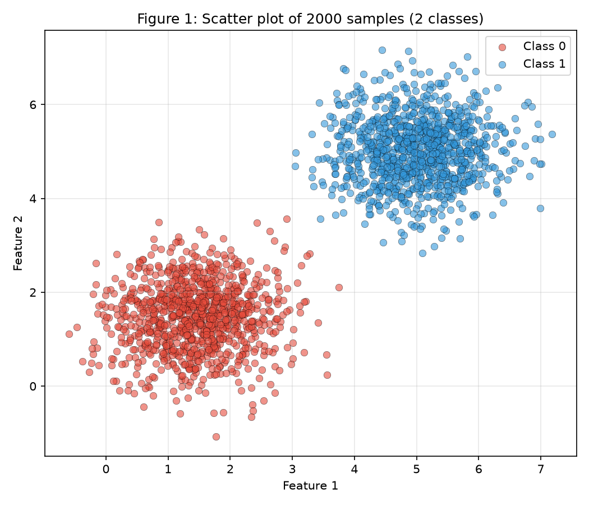
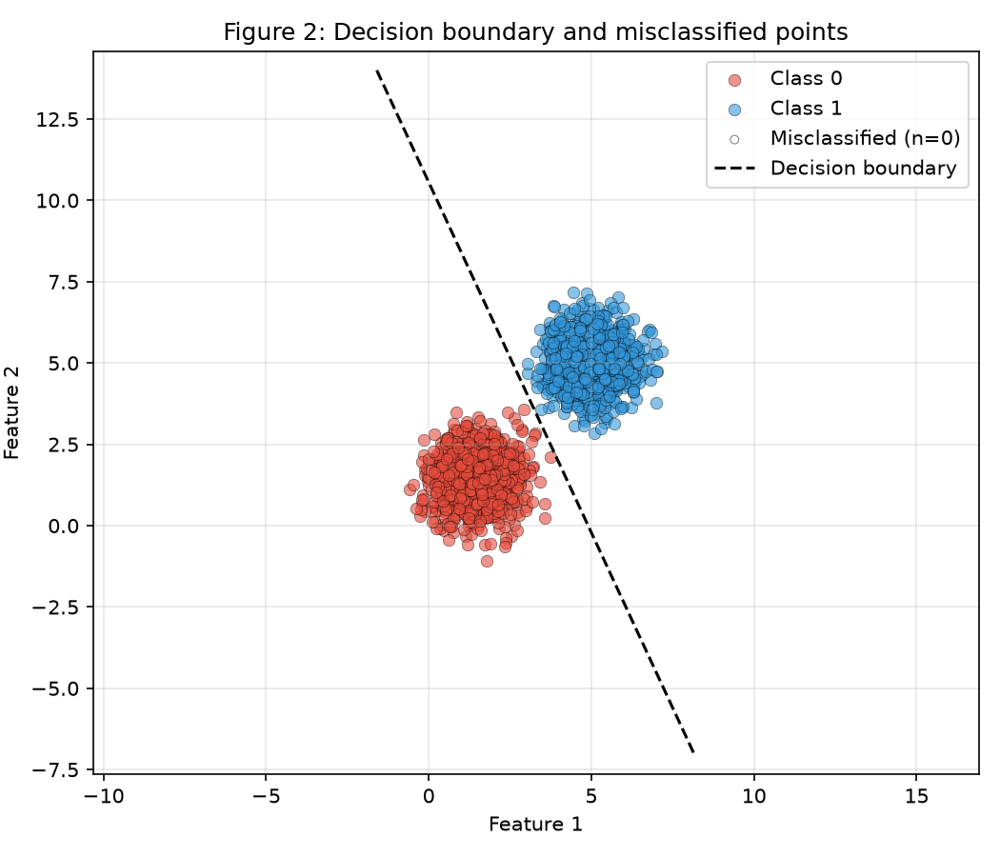
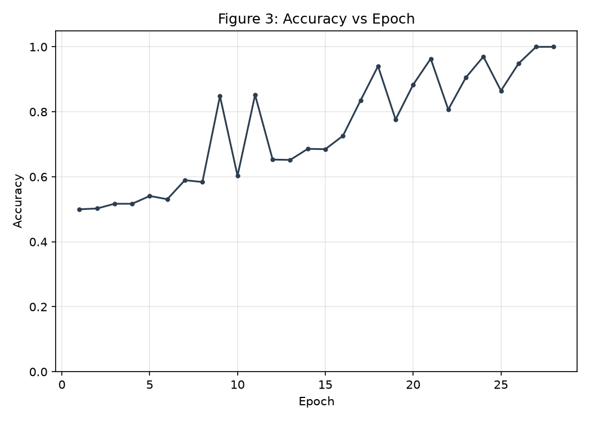
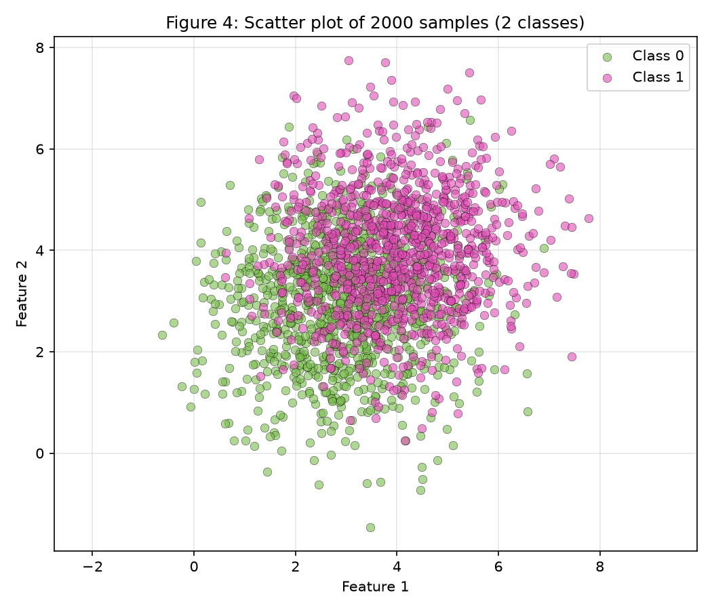
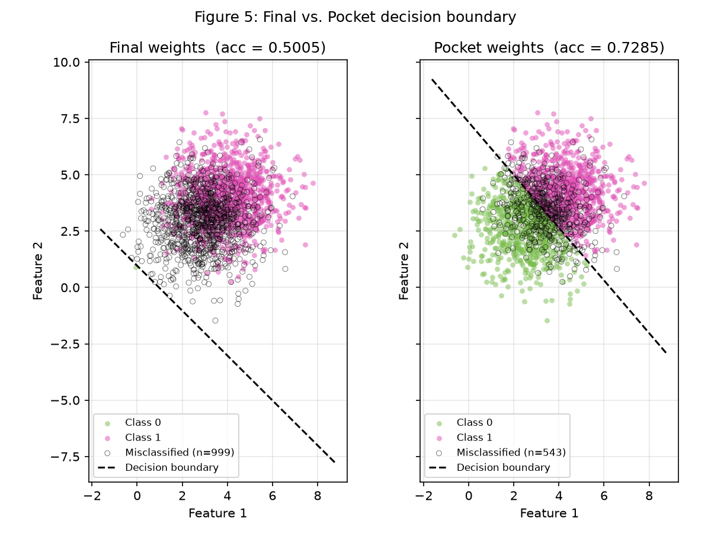
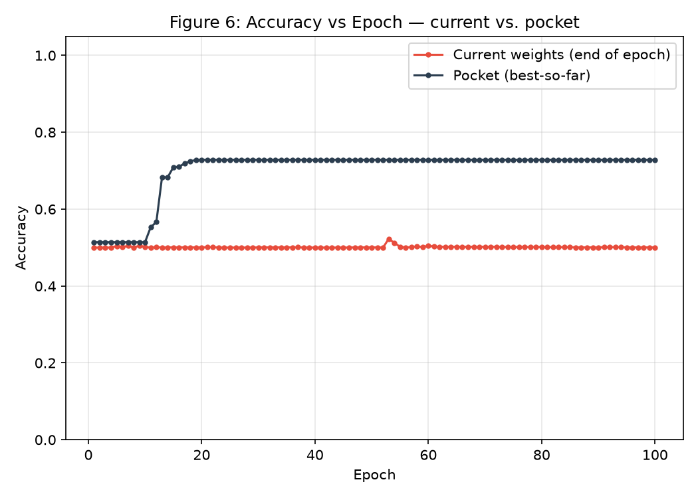

# 2. Perceptron

!!! abstract "Assignment"

    [Exercises → Perceptron](https://insper.github.io/ann-dl/2026.2/exercises/perceptron/){:target='_blank'}

## Understanding Perceptrons and Their Limitations

This section looks at Perceptrons and where their limits show up. The same perceptron is trained on two datasets - one it can solve cleanly, and one it can't - and the focus isn't just on that second failure, but on *how* it fails: what the learning process looks like when separability breaks down.

## Exercise 1 - Separable Data: The Case The Perceptron Was Designed For

### A - Generating the Data

Two classes of 2D points are generated, 1000 samples per class, drawn from multivariate normal distributions:

* **Class 0**: Mean = $[1.5, 1.5]$, Covariance = $[[0.5, 0], [0, 0.5]]$
* **Class 1**: Mean = $[5, 5]$, Covariance = $[[0.5, 0], [0, 0.5]]$

The means sit far apart relative to the spread, so the two clouds end up linearly separable, with at most a handful of exceptions.

``` { .python .copy .select linenums="1" }
   --8<-- "exercises/perceptron/exercise1.py:itemA"
```

Figure 1 shows a scatter plot of all 2000 points, colored by class.



### B - Implementing the Perceptron

A perceptron is one of the simplest possible neural networks: a single artificial neuron that takes a set of inputs, weighs them, sums them up, and passes the result through a step function to produce a binary output. It learns by adjusting those weights whenever it gets a prediction wrong, nudging its decision boundary - always a straight line (or hyperplane, in higher dimensions) - a little closer to correctly separating the two classes. This makes it the natural starting point for classification: powerful enough to solve linearly separable problems, but, as later exercises show, unable to go beyond them.

A single-layer perceptron is written from scratch here, as a reusable class - the same implementation carries over into Exercise 2.

* **Prediction**: $\hat{y} = \text{step}(\mathbf{w} \cdot \mathbf{x} + b)$, where $\text{step}(z) = 1$ if $z \geq 0$ and $0$ otherwise.
* **Update rule**: for each sample $(\mathbf{x}, y)$, $\hat{y}$ is computed and applied as

$$\mathbf{w} \leftarrow \mathbf{w} + \eta (y - \hat{y}) \mathbf{x}, \qquad b \leftarrow b + \eta (y - \hat{y})$$

with $y, \hat{y} \in \{0, 1\}$. The error $(y - \hat{y})$ is 0 on a correct prediction - so correctly classified samples produce no update — and $+1$ or $-1$ on the two kinds of mistake.

> **Why not $\mathbf{w} \leftarrow \mathbf{w} + \eta y \mathbf{x}$?**
> That form belongs to the convention where labels are $-1$ and $+1$. With the $0/1$ labels used here, it would never update on Class 0, so the perceptron could never correct a false positive — the rule has to match the labels.

* **Initialization**: $\mathbf{w}$ is drawn from `rng.normal(0, 0.01, size=2)`, with $b = 0$. Starting from $\mathbf{w} = \mathbf{0}$ is avoided on purpose: with the learning rate under scrutiny later on, an all-zero start makes the rate provably irrelevant, since it only rescales $\mathbf{w}$ without changing the decision boundary or the epoch count.
* **Learning rate**: $\eta = 0.01$.
* **Stopping**: training continues until a full pass over the dataset produces no update, or for a maximum of 100 epochs, whichever comes first — with accuracy on the full dataset recorded after every epoch.

``` { .python .copy .select linenums="1" }
   --8<-- "exercises/perceptron/exercise1.py:itemB"
```

### C - Training and Measuring

The model is trained on the dataset, converging after 28 epochs with a final accuracy of 1.0000, final weights $\mathbf{w} = [0.0530, 0.0246]$, and final bias $b = -0.2600$.

``` { .python .copy .select linenums="1" }
   --8<-- "exercises/perceptron/exercise1.py:itemC"
```

Figure 2 shows the decision boundary $\mathbf{w} \cdot \mathbf{x} + b = 0$ drawn over the data points, with any misclassified points marked differently - none remain, since the final accuracy is perfect.

``` { .python .copy .select linenums="1" }
   --8<-- "exercises/perceptron/exercise1.py:itemC-plot"
```



Figure 3 plots accuracy against epoch, tracking the climb from chance level (0.50) up to full separation by epoch 27–28. The rise isn't perfectly monotonic — accuracy dips and spikes along the way (e.g. epoch 9 jumps to 0.8485 before falling back to 0.6030 at epoch 10) - reflecting how each weight update can temporarily overcorrect before the boundary settles.

``` { .python .copy .select linenums="1" }
   --8<-- "exercises/perceptron/exercise1.py:itemC-plot-accuracy"
```


### D - Analysis

## Exercise 2 - Overlapping Data: The Case The Perceptron Cannot Solve

### A - Generating the Data

Two classes of 2D points are generated, 1000 samples per class:

* **Class 0**: Mean = [3, 3], Covariance = [[1.5, 0], [0, 1.5]]
* **Class 1**: Mean = [4, 4], Covariance = [[1.5, 0], [0, 1.5]]

The means are now close together and the spread is three times larger, so the clouds overlap heavily - no straight line separates them.

``` { .python .copy .select linenums="1" }
   --8<-- "exercises/perceptron/exercise2.py:itemA"
```

Figure 4 shows a scatter plot of all 2000 points, colored by class.



### B - Training, Keeping the Best Weights

The implementation from Exercise 1 is reused, with the same $\eta = 0.01$ and the same 100-epoch cap - modified with a `fit` method that adds the pocket-tracking logic on top of the original update loop. Because this data isn't separable, the training loop never settles - it keeps updating right up to the epoch limit - so two sets of weights are tracked instead of one:

* the final weights — whatever the loop happens to hold after the last epoch;
* the pocket weights — the best-so-far: every time an update produces a higher accuracy on the full dataset than any previously seen, $(\mathbf{w}, b)$ is copied into the "pocket" and kept. This is the *pocket algorithm*, and the copy is the only addition to the loop.

``` { .python .copy .select linenums="1" }
   --8<-- "exercises/perceptron/exercise2.py:itemB"
```

``` { .python .copy .select linenums="1" }
   --8<-- "exercises/perceptron/exercise2.py:itemB-weights"
```

The two sets of weights, and their accuracy, turn out as follows:

**Final weights**: $\mathbf{w} = [0.0413, 0.0415]$, $b = -0.0400$, accuracy = 0.5005

**Pocket weights**: $\mathbf{w} = [0.0064, 0.0055]$, $b = -0.0400$, accuracy = 0.7285

The two numbers end up far apart - the final-iterate accuracy lands right at 50%, no better than random guessing, precisely because the loop never converges and drifts into a bad state right on its last update. The pocket weights, by contrast, hold onto the best boundary found at any point during training - still far from perfect on data this overlapped, but noticeably better than chance. That gap is the expected outcome of training on inseparable data.

### C - Figures

Figure 5 shows both decision boundaries - final and pocket - drawn over the data points, with misclassified points marked.

``` { .python .copy .select linenums="1" }
   --8<-- "exercises/perceptron/exercise2.py:itemC-plot"
```



Figure 6 plots two curves against epoch: the accuracy of the current weights at each step, and the best-so-far accuracy.

``` { .python .copy .select linenums="1" }
   --8<-- "exercises/perceptron/exercise2.py:itemC-plot-accuracy"
```



### D - Analysis

## Results Summary

| # | Quantity | Value |
|---|----------|-------|
| 1 | Exercise 1 — final $\mathbf{w}$ and $b$ | [0.0530, 0.0246], -0.26 |
| 2 | Exercise 1 — epochs to convergence | 28 |
| 3 | Exercise 1 — final accuracy | 1.00 |
| 4 | Exercise 1 — epochs and final accuracy with $\eta = 1.0$ | 33, 1.00 |
| 5 | Exercise 2 — final $\mathbf{w}$ and $b$ | [0.0413, 0.0414], -0.04 |
| 6 | Exercise 2 — accuracy of the final weights | 0.5005 |
| 7 | Exercise 2 — accuracy of the pocket weights | 0.7285 |
| 8 | Exercise 2 — epoch at which the pocket best occurred | 53 |